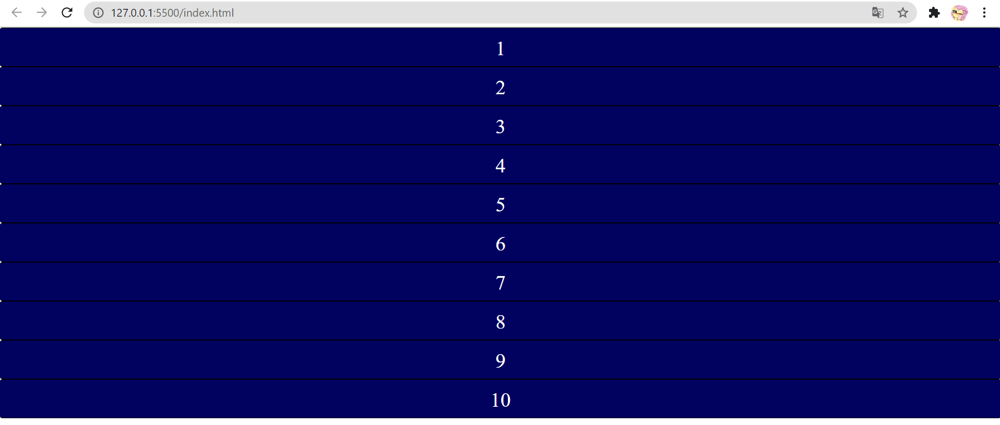
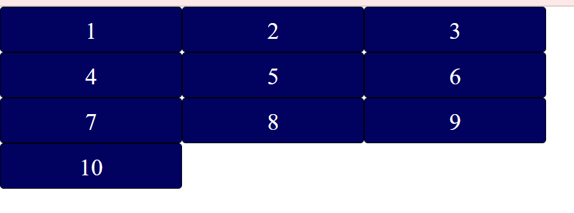
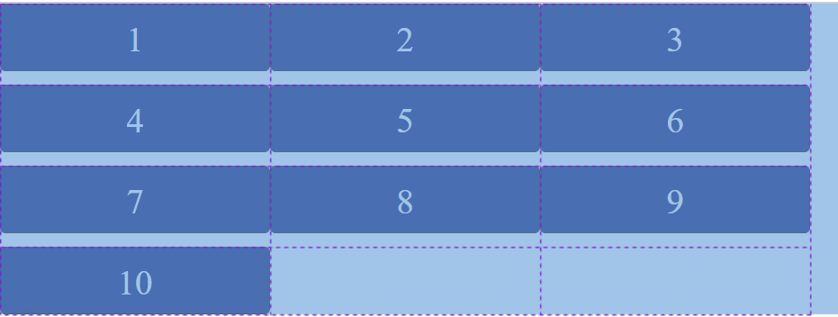
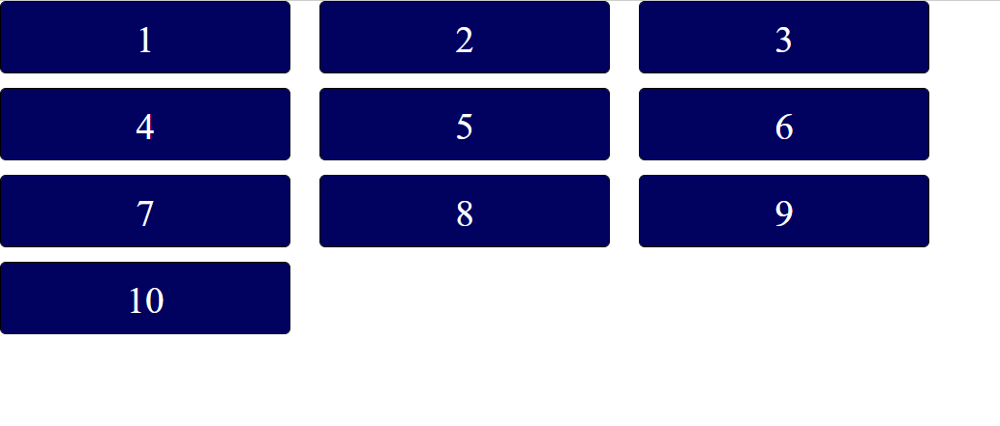
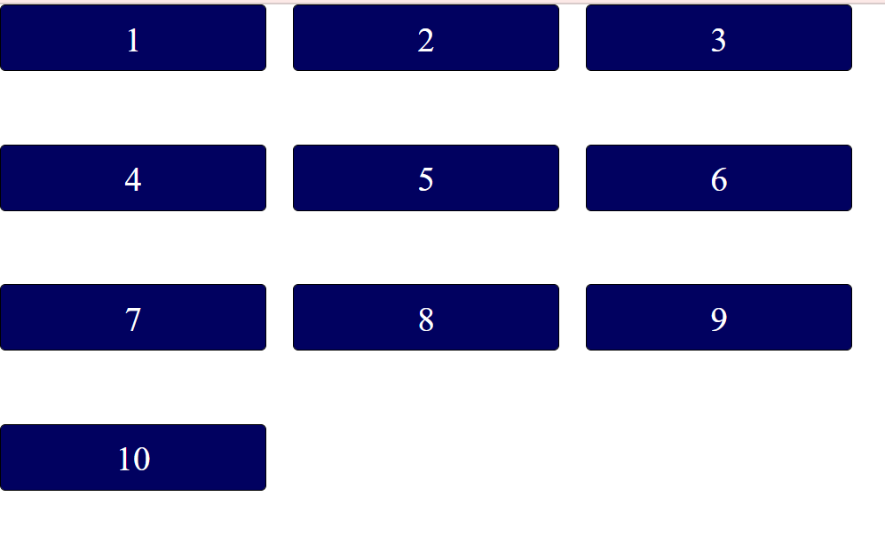

##### [grid-template-columns](#grid-template-columns), [grid-template-rows](#grid-template-rows), [column-gap](#columnGap)
##### [row-gap](#rowGap), [gap](#gap), [grid-template](#grid-template)
## Начало работы с css grid ##

### display:grid ###
Для начала работы нам нужен  grid контейнер, в css указываем нашему контейнеру display:grid;(display в css указывает как будет отображаться элемент, блок,инлайн блок флексы или же гриды и тд.)
```css
.grid-container {
    display:grid;
}
```
Вот так сейчас выглядят наши элементы:
<br>
### grid-template-columns: ###
Работа похожа на Flexbox. Какие-то свойства будем применять к контейнеру, а какие-то к элементам внутри.<br>
Далее мы создадим колонки с помощью свойства <a name="grid-template-columns"> grid-template-columns. </a>
```css
.grid-container {
    display:grid;
    grid-template-columns: 200px 200px 200px; /*три колонки по 200px. Здесь можно использовать любые единицы*/
}
```
Теперь у нас три колонки по 200px. По сути это уже сетка, она сформировалась даже с одним свойством.
<br>
### grid-template-rows: ###
Далее мы используем <a name="grid-template-rows"> grid-template-rows </a> - это свойству укажет количество строк.
```css
.grid-container {
    display:grid;
    grid-template-columns: 200px 200px 200px;
    grid-template-rows: 60px 60px 60px;
}
```
Теперь у нашей сетки есть и строки по ширине. Если мы наведем в инспекторе кода на наши элементы, то мы сможем увидеть эту сетку. Наша высота строк для сетки указана в 60px, а высота наших элементов 50px, поэтому есть расстояние в 10 пикселей между строками. Последний элемент не вмещается никуда, но автоматически под него создалась еще одна строка.
<br>
### column-gap ###
Что бы указать промежуток между столбцами, используем <a name="columnGap"> column-gap </a><br>
Вы так же можете встретить старый вариант этого свойства grid-column-gap, сейчас это свойство не используется.
```css
.grid-container {
    display:grid;
    grid-template-columns: 200px 200px 200px;
    grid-template-rows: 60px 60px 60px;
    column-gap:20px;
}
```
<br>
### row-gap ###
И точно такие же промежутки мы можем сделать и между строками с помощью <a name ="rowGap"> row-gap </a>
```css
.grid-container {
    display:grid;
    grid-template-columns: 200px 200px 200px;
    grid-template-rows: 60px 60px 60px;
    column-gap: 20px;
    row-gap: 45px;
}
```
<br>
### Свойство gap ###
Свойство <a name ="gap"> gap</a> объеденяет в себе column-gap и row-gap. Раньше использовалось grid-gap, сейчас это свойсвто уже устарело, но его можно встретить. 
```css
.grid-container {
    display:grid;
    grid-template-columns: 200px 200px 200px;
    grid-template-rows: 60px 60px 60px;
    gap: 45px 20px; /*Эта запись идентична тому, что у нас было*/
}
```
### grid-template ###
<a name ="grid-template"> grid-template </a> - это сокращение для grid-template-columns: и grid-template-rows. Первым указываем наши строки и через / указываем колонки:

```css
.grid-container {
    display:grid;
    grid-template: 60px 60px 60px / 200px 200px 200px;
    gap: 45px 20px; 
}
```
С такой записью у нас ничего не изменилось.
<br>
